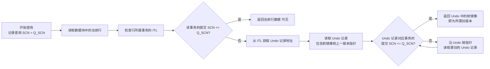
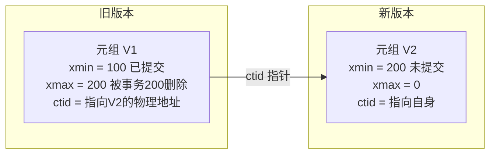

[TOC]

# 引言

关系型数据库有别于非关系型数据库和其他数据存储介质最为核心的却别在于ACID，即保证**事务（Transaction）** 正确可靠的四个核心设计。

|  ACID    |实现技术 |
| ---- | ---- |
|原子性|MVCC|
|一致性|约束（主键、外键等）|
|隔离性|MVCC|
|持久性|WAL|

**MVCC（Multi-Version Concurrency Control，多版本并发控制）** 是一种用于提高数据库并发性能的机制。它让**读操作不阻塞写操作，写操作也不阻塞读操作**，从而大幅提升事务并发能力。

## MVCC解决了什么问题

早期数据库系统为了实现数据一致性，实现的是传统锁机制，读操作会加共享锁（读锁），写操作会加排他锁（写锁）。
以下两种操作互斥：
- 一个事务写某行时，其他事务必须等待该行解锁才能读。
- 一个事务读某行时（尤其长查询），其他事务无法修改该行。

传统锁在高并发场景下，读写冲突严重，数据仓库和 OLTP 混合场景几乎不可行，必须错峰操作，这一系列的劣势大大削弱了数据库系统的实用性，而且给应用开发平添了很高的复杂度。

MVCC 是现代数据库（如 PostgreSQL、Oracle、MySQL InnoDB）从传统锁系统进化的关键里程碑，它让数据库在 **ACID** 的前提下，获得了接近无锁的高并发能力。

# MVCC的主流实现范式

##  基于Undo日志的实现方式

在Oracle数据库，或者 MySQL的InnoDB引擎中，某条数据的更新会直接修改该行的磁盘块，被更新行的旧版本数据会被转移至Undo日志（或回滚段）中。

以oracle数据库为例，如果此时某个事务需要查询旧版本的数据，那么数据库会尝试在回滚段内寻找该行对于当前事务的可见快照，由于某一行数据可能会被多个事务更改，那么整个回溯过程会被进行多次，直至找到目标版本数据。

基于回滚段的实现多版本并发控制，得益于其原地更新的特性，表的水位线与实际的文件大小基本不会因为频繁更新而增大，但是其commit与rollback操作会耗费大量的时间与资源。

回滚段与Undo日志并不是无限大的，其导致的最为经典与常见的问题就是ORA-01555快照过旧，由于一个事务在整个回滚段中都查不到可见版本会导致的查询报错

## 保留多份物理版本的实现方式

基于多物理版本的MVCC，其核心思路是：在更新数据时，**不修改旧数据**，而是直接创建一个包含新值的数据版本。旧版本依然保留在数据文件中，等待清理。

# PG数据库MVCC原理详解

## MVCC多版本标记关键词

- XID：数据库的事务ID
- xmin,xmax, 行头部的XID信息 xmin表示插入这条记录的事务XID xmax表示删除这条记录的事务XID 
- xid_snapshot : 当前集群中的未结束事务 
- clog : 事务提交状态日志（存储某个事务ID最终提交或是回滚）

**事务ID（XID）使用32位无符号数来表示，顺序产生， 依次递增每个元组会来用（t_xmin, t_xmax）来标示 自己的可用性 t_xmin 存储的是产生这个元组的事务ID，可能是 insert或者update语句 t_xmax 存储的是删除或者锁定这个元组的XID 每个事务只能看见t_xmin比自己XID 小且没有被删除的元组**

## MVCC多版本标记字段

每个表的每行数据（称为一个tuple），包含有4个隐藏字段，可直接访问

- xmin 在创建（insert）记录（tuple）时，记录此值为插入tuple的事务ID 
- xmax 默认值为0，在删除tuple时，记录此值
- cmin和cmax 标识在同一个事务中多个语句命令的序列值，从0开始，用于同一个 事务中实现版本可见性判断 

### 数据行版本链

有别于oracle实时构建旧版本的方式，pg数据库采用增加新版本数据的方式，维护完整的从旧到新的单向链表

## MVCC多版本并发控制的实现

数据的修改过程可简单描述为： 

1. 首先 backend 开启是一个事务,获得一个事务号XID;
2. 在这个事务中对数据的任意修改，都被XID 标记。
3. 其他 backend 在扫描数据时，会看到被这个XID 修改过的数据，根据当前的隔离级别，选择对这些 数据是否可见（默认的读已提交隔离级别看不到这些数据）。
4.  只有当此 XID 最后被标记成commit （写WAL commit log 和写 clog）后，其他的 backend 才 能看到这个XID 修改的数据。

~~~mermaid
flowchart LR
    A[Backend1 开启事务 获得事务号 XID] --> B[Backend1 修改数据 用 XID 标记修改]
    B --> C{Backend2 扫描数据 看到 XID 修改的数据}
    C -- 读已提交隔离级别 XID 未提交 --> D[Backend2 不可见 跳过该数据]
    C -- 其他隔离级别 --> E[按规则决定可见性]
    D --> F[Backend1 写入 WAL commit log 并更新 clog]
    E --> F
    F --> G[Backend1 事务提交 XID 标记为已提交]
    G --> H[Backend3 再次扫描 看到 XID 修改的数据 可见]
~~~

## 数据可见性条件

1. 记录的头部XID信息比当前事务更早（看见比自己小的事务id） （repeatable read或ssi有这个要求,  read committed没有这个要求=只要提交的事务不管大小都可读）

2. 记录的头部XID信息不在当前的XID_snapshot中 (即记录上的事务状态不是未提交的状态.) 

3. 记录头部的XID信息在CLOG中应该显示为已提交

   

~~~mermaid
xychart-beta
    title “PostgreSQL 版本链 (事务ID数轴)”
    x-axis “事务ID” [100, 200, 300, 400]
    y-axis “版本存活” 0 --> 1
    line [1, 1, null, null]    “版本V1: xmin=100 xmax=200”
    line [null, 1, 1, null]    “版本V2: xmin=200 xmax=300”
    line [null, null, 1, 1]    “版本V3: xmin=300 xmax=0 (永久)”
~~~

